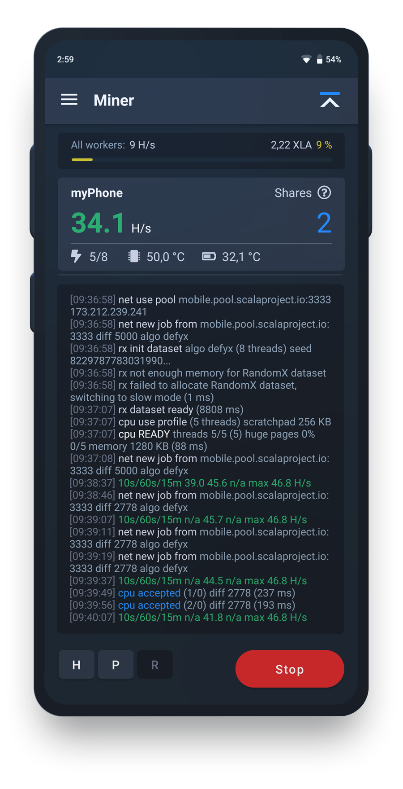

# Mobile Mining

## Mobile Miner

The Mobile miner is an application able to solve low diff blocks given by any pool server that supports it. For now, the application is only available for Android devices, because Apple limits the implementation and distribution of cryptocurrency and mining applications.

The maximum temperature the device can reach when mining will be set using a deep learning program within the app called AMYAC, whose purpose is to locate a mobile phone's maximum and safe operating temperature (although most devices can get warmer).

When the CPU reaches that limit, the miner turns itself off until the phone gets back to normal temperatures and then begins once the device is back to the 0 potential range. This way we can ensure the device never gets so warm that the lithium ion battery suffers any damage.

## AMYAC protocol 

The AMAYC (As-much-as-you-can) protocol that we developed uses deep learning to find devices optimal settings, allowing to mine without damaging hardware while easing power consumption.

Benchmarking is done on the client side in the first few mining CPU cycles which takes around 8.6 seconds on a mid tier smartphone. It makes use of a pre trained neural network to give an efficiency rating used by the miner to calibrate later on. The dataset training the network is a culmination of data from hundreds of devices, providing us with a clear cut idea of how good it can perform without damaging itself.

Below given is a sample set of data which is used to train the neural network.

.png>)

## Neural Network implementation for AMYAC protocol

Traditional benchmarking techniques do not fit well to the mobile devices use cases. They are too slow, computationally intensive and usually do not take the device temperature in account. With the neural network we will be able to find the standard in a very short span of time and also resource efficiently.

For the implementation we will be using a simple classifier. We have made a custom node module for tests, the usage is very simple as shown below, the code for this module will be opensourced along with the miner.

.png>)

From the above code it shows that the hash rate of 5H/s at 35 degree celsius is somewhat okay clocking in at 50% rating. From this we can truly understand the potential of this benchmarking approach.
