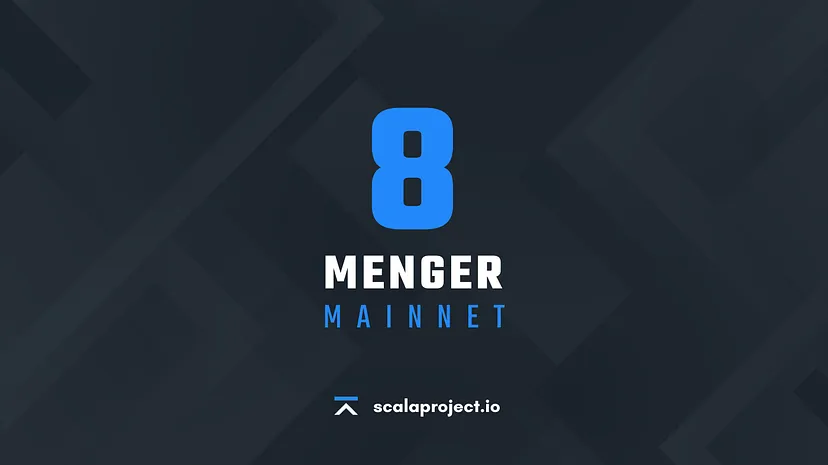

# History

## January 22, 2018

01:21:34  - Stellite genesis block was mined

## February 2018

#### Listing on Crex24


crex24.com


## March 2018

#### Listing on TradeOgre


TradeOgre (BTC-XLA)



TradeOgre (LTC-XLA)


\
April 4, 2018
-------------

#### Stellite forked from the new V7 Cryptonight algorithm with some adjustments

## April 10, 2018

#### Listing on Coinmarketcap


coinmarketcap.com


\
May 4-5, 2018
-------------

#### First conference in Amsterdam at Chainges


Chainges Event


## June 6, 2018

[Stellite v1.2.4.0 'Titanium v1'](https://github.com/scala-network/Scala/releases/tag/1.2.4.0)

Titanium v1 Fork at block height: 194600.&#x20;

Highlights for V4 include:

* Changed Proof-of-Work algorithm to our custom XTL variant 2
* An improved Difficulty Adjustment Algorithm (DAA)
* A bump in minimum network fee and increased median blocksize limit

With this release, we added a new `stellite-blockchain-downloader` tool.

## January 10, 2019

[Stellite v2.0.0.0 'Adamantium'](https://github.com/scala-network/Scala/releases/tag/2.0.0.0)

Adamantium V2 Fork at block height: 503001.

Highlights for V5 include:

* A complete update to support the latest Monero features including Bulletproofs
* A better transaction experience by consolidating outputs
* Move from 1-minute blocks to 5-minute blocks
* An update to our Proof-of-Work algorithm
* Improvements to our Difficulty Adjustment Algorithm (DAA)

## March 22, 2019

Rebranding to **Torque** due to copyright issues with the name "Stellite".



## August 13, 2019

[Scala v3.0.0.0 'V6 Himalaya'](https://github.com/scala-network/Scala/releases/tag/3.0.0.0)

**Final rebranding to the official name: Scala**

More information: [https://twitter.com/ScalaHQ/status/1154095108138131457](https://twitter.com/ScalaHQ/status/1154095108138131457)

**Himalaya V6 Fork at block height: 563810.**

Highlights for V6 include:

* New proof-of-work named DefyX.
* A complete update to support the latest XMR features and bug fixes.
* Changed emission curve and supply.

## March 12, 2020

The first release of the official Scala Mobile Miner, a high-performance and open-source application for mining Scala on Android mobile devices.

Download here: [https://github.com/scala-network/MobileMiner/releases](https://github.com/scala-network/MobileMiner/releases)

Some highlights of this application are:

* AMAYC machine-learning algorithm to protect the device
* Temperature display
* QR code feature to capture wallet address
* Completely redesigned UI
* Refactored framework
* Payout widget
* Live Pool statistics for pools based on nodejs-pool cryptonote-nodejs-pool frameworks

## July 31, 2020

Panthera V7 hard fork at block height: 662646.

Highlights for V7 include:

* LdPoW - A custom version of dPoW that will help against malicious attacks as well as help in increasing the sync speed of the daemon.
* An overhaul of the Scala wallet which will help increase performance.
* Updated DefyX to Panthera - the algorithm now includes Yespower instead of Yescrypt which helps both security and reliability.
* Updated Scala with the latest XMR release containing bug fixes and new features.
* Completely reworked economics and emissions to help further benefit the users of the platform.

## September 20, 2021

The first release of Scala Vault, a secure and lightweight wallet to store your Scala coins on any Android device.

Download here: [https://github.com/scala-network/ScalaVault/releases](https://github.com/scala-network/ScalaVault/releases)

Some highlights of this application are:

* Multiple Wallets
* Subaddress Support
* Stealth Mode
* QR Code Scanning
* Automatic price conversion to other currencies
* Address Book
* Easy-to-use UI

## February 17, 2021

The second major release of the official Scala Mobile Miner, a high-performance and open-source application for mining Scala on Android mobile devices.

Download here: [https://github.com/scala-network/MobileMiner/releases](https://github.com/scala-network/MobileMiner/releases)

Some highlights of this release are:

* Support for ARMv7 devices
* Support for older Android SDKs
* Revisited UI/UX
* Mining Dashboard
* Setup Wizard
* New Payout Widget
* Hashrate and Temperature charts
* Updated statistics, balance and payouts
* Get Support page
* Better stability
* Fixed minors bugs

## June 8, 2021

.png>)

The MVP release of Scala Share, a decentralized content delivery network built on IPFS.


Scala Share App


More information: [https://medium.com/scala-network/scala-share-decentralized-file-sharing-2df781738193](https://medium.com/scala-network/scala-share-decentralized-file-sharing-2df781738193)

## October 28, 2021

The release of the Menger V8 specifications.

More information: [https://medium.com/scala-network/menger-v8-specifications-75a8abb9a3c5](https://medium.com/scala-network/menger-v8-specifications-75a8abb9a3c5)

## November 18, 2021

Creation of the Haku Labs Non-Profit Organization.

More information: [https://medium.com/scala-network/haku-labs-scalas-non-profit-organization-4456e4739ce](https://medium.com/scala-network/haku-labs-scalas-non-profit-organization-4456e4739ce)

## April 13, 2022

The start of the V8 Menger testnet and airdrop.

More information: [https://medium.com/scala-network/v8-menger-testnet-airdrop-f363f50ca2d9](https://medium.com/scala-network/v8-menger-testnet-airdrop-f363f50ca2d9)

## July 5, 2022

The release of Scallet, a simple browser-based wallet with everything you need to store XLA coins and manage transactions.


Scallet App


More information: [https://medium.com/scala-network/scallet-scalas-web-wallet-payment-gateway-db6a7e29d808](https://medium.com/scala-network/scallet-scalas-web-wallet-payment-gateway-db6a7e29d808)

## November 2022

The first V8 Menger node operators elections.

More information: [https://medium.com/scala-network/diardi-election-results-dfc65436d655](https://medium.com/scala-network/diardi-election-results-dfc65436d655)

## September 30, 2023

The release of the Menger V8 mainnet.

<figure><figcaption></figcaption></figure>

More information: [https://medium.com/scala-network/v8-menger-mainnet-bca35aa69d63](https://medium.com/scala-network/v8-menger-mainnet-bca35aa69d63)
